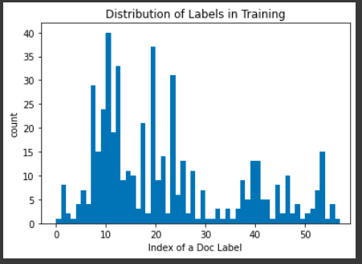

# Linear Neural Network Model to Classify Opioid Industry Documents
## Rena Liu working under Dr. Anqi Liu | JHU Computer Science
## Spring 2022

### Background
The goal of this project is to classify industry documents related to the U.S. opioid epidemic into classes of document type (legal, report, publication, graph, etc.) to support legal and social research regarding the epidemic.

As a proof of concept, I spent the Spring 2022 semester (January to September) implementing a simple linear neural network (NN) model which classifies the document title of tobacco industry documents.

### Key Links
- [Tobacco Industry Document Database](https://www.industrydocuments.ucsf.edu/tobacco/): Where input data (document titles) and labels (document type class) were pulled from.
- [Proof of Concept Model Implementation on Colab](https://colab.research.google.com/drive/1hZ6dUUoT2MfJGhgG_CJ0JLhKlS4o1yON?usp=sharing) (held_out_test_v5_title_classification_model.ipynb): Google Colab file (Python notebook) of the working NN model
- [Sample Pre-processing Colab](https://colab.research.google.com/drive/13KiLSh2RPqkSmXl8gmubdOJuh7nQQnvZ?usp=sharing) (file_pre_processing.ipynb): Google Colab file which takes a folder of samples and creates a csv of each encoded sample and its document type label (explained further in Data Collection)
- [Google Doc of Documentation](https://docs.google.com/document/d/1bhzakiC6MqCivCSIa3mdNHHjts5luuNO/edit?usp=sharing&ouid=106298455749927186906&rtpof=true&sd=true): Contains many redudant info as this README, along with meeting notes from weekly meetings between Rena and Anqi during the Spring 2022 semester.
- Liu Sample 500.xlsx: Excel document containing the file names for 500 OCR formatted opioid documents ("id" column) and their correponding hand-labelled document types ("Doc Type 1" column)
- encoded_labeled_ocrs.csv: CSV document containined all 500 file samples after they have been processed by the Sample Pre-processing Colab, meaning each of the 500 OCR file samples have been encoded by the BERT language model.

### Data Collection
The most up-to-date Proof of Concept implementation utilizes the 500 samples of opioid industry documents. These samples were provided in a zip folder of samples, with each sample consisting of its own folder labeled by id and consisting of a pdf, thumbnail png, and ocr file (ocr stands for Optical Character Recognition and is a file type consisting of the entirety of the document contents: text, images, formatting, etc.). 

The preprocessing Colab Python notebook takes this greater zip folder and iterates through each sample folder, pulling the ocr file and using the BERT transformer (more specifically the DistilBertTokenizerFast language model) to tokenize and encode the data of the ocr file. The encoded data (input_ids and attention_mask) is then stored in a DataFrame and then csv along with a numerical index corresponding to the sample’s document type label (for example: legal corresponding to 1, report to 2, etc.). This downloaded file is named encoded_labeled_ocrs.csv.

_Histogram of distribution of classes (various document type labels) in the dataset_

Previous iterations of the linear NN were tested on tobacco industry document titles pulled from the database linked above.

### Model Implementation 
The Linear NN model was implemented by loosely following this PyTorch tutorial.

Currently the best results (accuracy of 15%) with the full 500 samples are with the hyperparameters stated below:
batch size of 100
learning rate of 5e-3
30 epochs
Model architecture of
512 in_features, 480 out_features
480 in_features, 336 out_features
336 in_features, 57 out_features

XXXX MORE DETAILS HERE

Each section of the Python Notebook Proof of Concept Model Implementation on Colab (batch v3_title_classification_model.ipynb) is outlined below:

**Set-up**: This imports all the libraries and packages (torch, numpy, pandas, etc.)

**Label pre-processing**: This pulls and opens the encoded_labeled_ocrs.csv (creation explained above) which holds the encoded file samples (input_ids and attention_mask) and corresponding numerical document type labels. The data within this file is then converted into arrays of Floats. The input_ids and labels are then formatted and batched. (The batched gradient descent technique differs from stochastic gradient descent in that parameters of the model which factor into the prediction are updated in groups with each iteration of learning and minimizing loss, as opposed to individually. This smooths the learning and loss process.)

_Note/Area for Improvement 1_: The attention_mask component of the input encodings (which includes the input_ids and attention_mask components) has not been incorporated into the final formatting and batched sets which are fed to the model.

**Plotting Label Distribution (Optional)**: This section is commented out, but uses MatPlotLib to plot the distribution of labels for the training and test set to visualize how many documents of each document type there are, and therefore how balanced the dataset is.

**Defining the Linear NN**: This section defines the Net class for the neural network. This is based on a Pytorch tutorial and many lines are commented out but kept to give context of the possibilities of nonlinear and otherwise more complicated models. 

**Define a Loss function and optimize**: This section sets the loss to be Cross Entropy Loss and the optimizer to be from Adam. 

**Train Network**: This section iterates through epochs and batches to feed the input_ids (of type float) into net(). Code to collect training loss and accuracy is based on a tutorial linked here. Code to print the prediction each time also exists but is commented out. The collected loss and accuracy are then printed onto a graph using MatPlotLib.

